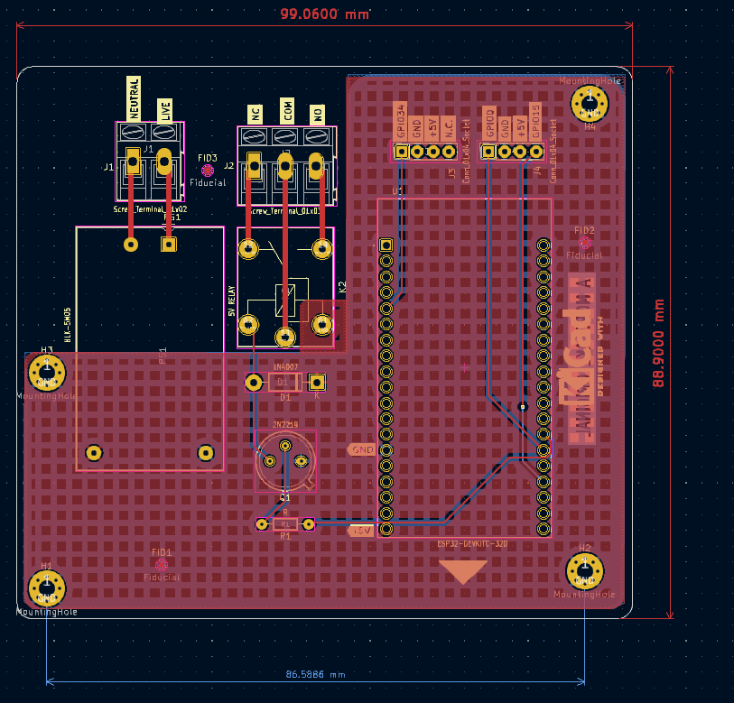
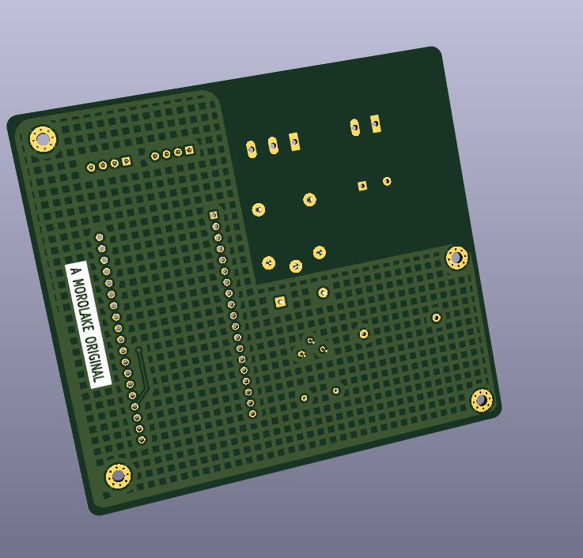

# 🔌 ESP32 Smart Switch

A compact smart switching board that uses an **ESP32**, **PIR motion sensor**, and **microphone module** to detect presence or sound and control a relay for switching AC appliances hands-free.

---

## 📋 Overview

This project enables hands-free control of appliances using:
- 🕵🏽 PIR sensor for motion detection
- 👏 Sound sensor for sound triggers (e.g., claps)
- 🔁 A relay to switch AC loads
- ⚡ HLK-PM05 module for safe AC-to-DC power conversion

Ideal for automating lights, fans, or sockets in a room using movement or sound.

---

## 🔩 Hardware Specs

| Component            | Description                                |
|----------------------|--------------------------------------------|
| **Microcontroller**  | ESP32 DevKitC                              |
| **Motion Sensor**    | HC-SR501 PIR                               |
| **Sound Sensor**     | Analog Mic module with comparator output   |
| **Relay**            | 5V SPDT mechanical relay                   |
| **Power Module**     | HLK-PM05 (AC-220V to 5V DC)                |
| **Driver**           | 2N2219 NPN transistor + 1N4007 flyback diode |
| **Design Software**  | KiCad                                      |

---
## 🖼️ PCB Images

### 📐 PCB Layout  

### 🎥 3D Bottom View  

### 🧊 3D Top View  

---

## ⚙️ How It Works

- ESP32 reads **digital signals** from the PIR sensor and microphone comparator
- If **motion OR sound is detected**, it triggers a GPIO pin
- GPIO controls a **transistor**, which switches the **relay coil**
- Relay contacts control an **AC load** (e.g. light bulb or fan)

The entire board is powered safely by the HLK-PM05, isolating mains from logic.

---

## 🧠 What I Learned

- Proper isolation of high-voltage AC and low-voltage logic on a PCB
- Using transistor + flyback diode to safely drive inductive loads
- Debouncing and noise filtering techniques for sound and motion sensors
- Smart sensor fusion logic in embedded systems

---

## 🚀 Possible Upgrades

- Add Wi-Fi-based notifications using ESP32’s onboard wireless
- Add manual toggle button
- Add LDR (light sensor) for day/night switching
- Improve enclosure for safety and aesthetics

---

## 📁 Files

- 📸 Project images in this folder
- Designed with KiCAD

---

**🔙 [Back to Home](../../README.md)**
